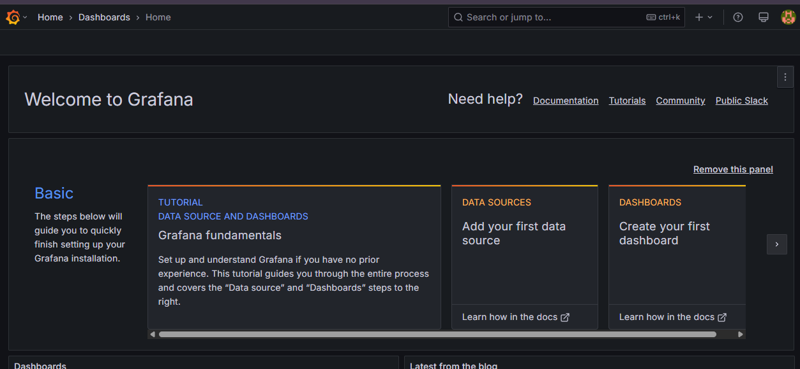

# AI Gamer Project - Part 2 - Setting Up

This is going to be night one of the project.

<!-- more -->

I'm hoping I can get the setup done in one go!. I'll leave my commands here in this blog incase you want to try to follow along. Bear in mind I'm going to be learning this as I go as well!

## Step 1: Prerequisites
Ensure you have the following installed:

- WSL 2 with a Linux distribution (Ubuntu is recommended)
- Docker Desktop
- kubectl (Kubernetes CLI)
- Helm (for package management in Kubernetes)
- Minikube (or K3s, but we'll start with Minikube)

I had WSL running on my system already so if you're jumping in you'll need to see how to do that yourself.

### Docker

```shell title="Update your package list and install dependencies"
sudo apt update && sudo apt install ca-certificates curl gnupg
```

```shell title="Add Docker’s official GPG key"
sudo install -m 0755 -d /etc/apt/keyrings
curl -fsSL https://download.docker.com/linux/ubuntu/gpg | sudo tee /etc/apt/keyrings/docker.asc > /dev/null
sudo chmod a+r /etc/apt/keyrings/docker.asc
```

```shell title="Add the Docker repository"
echo "deb [arch=$(dpkg --print-architecture) signed-by=/etc/apt/keyrings/docker.asc] https://download.docker.com/linux/ubuntu $(lsb_release -cs) stable" | sudo tee /etc/apt/sources.list.d/docker.list > /dev/null
```
```shell title="Install Docker"
sudo apt update && sudo apt install docker-ce docker-ce-cli containerd.io docker-buildx-plugin docker-compose-plugin
```
```shell title="Enable Docker to run without sudo (optional but recommended)"
sudo usermod -aG docker $USER
newgrp docker
```
```shell title="Verify Docker is installed correctly"
docker --version
docker run hello-world
```

```shell title="Restart WSL"
wsl --shutdown
```
then reopen WSL

### minikube

```shell title="install Minikube"
curl -LO https://storage.googleapis.com/minikube/releases/latest/minikube-linux-amd64
sudo install minikube-linux-amd64 /usr/local/bin/minikube
```
```shell title="Start Minikube using Docker as the driver"
minikube start --driver=docker
```
```shell title="Verify that the cluster is running"
kubectl get nodes -A
```

### Download and Install Helm

```shell
# Add the Helm repository
curl -fsSL https://baltocdn.com/helm/signing.asc | sudo tee /usr/share/keyrings/helm.asc > /dev/null
```
```shell
# Add the Helm APT Repo
echo "deb [signed-by=/usr/share/keyrings/helm.asc] https://baltocdn.com/helm/stable/debian/ all main" | sudo tee /etc/apt/sources.list.d/helm-stable-debian.list
```
```shell
# Update package lists and install Helm and Verify Install
sudo apt update && sudo apt install helm
helm version
```

### Deploy Prometheus and Grafana

```shell title="Add the helm repo and update"
helm repo add prometheus-community https://prometheus-community.github.io/helm-charts
helm repo add grafana https://grafana.github.io/helm-charts
helm repo update
```

```shell title="Install prometheus and Grafana in Kubernetes"
helm install prometheus prometheus-community/kube-prometheus-stack --namespace monitoring --create-namespace
helm install grafana grafana/grafana --namespace monitoring --set persistence.enabled=true --set persistence.size=10Gi
```

After install Grafana you'll get a prompt with how to get your admin password and how to access the application. Please note this command down so you can get this password when you need it.

```shell title="Get Grafana admin password"
kubectl get secret --namespace monitoring grafana -o jsonpath="{.data.admin-password}" | base64 --decode ; echo
```

```shell title="Verify a PVC was created for grafana so your dashboards persist"
kubectl get pvc -n monitoring
```

```shell title="Expose Grafana so you can acces it from your browser"
kubectl port-forward svc/grafana 3000:80 -n monitoring
```

[http://localhost:3000](http://localhost:3000)

Grafana is up and running



### Check in

!!! note "How's your set up looking so far? "

    So at this point my kubernetes cluster looks like this and hopefully yours does too! If you had any hang ups up to this point leave them in the comments below and I'll try to help!

    ```shell
    kubectl get pods -A
    NAMESPACE     NAME                                                     READY   STATUS    RESTARTS      AGE
    kube-system   coredns-668d6bf9bc-5bd24                                 1/1     Running   0             25m
    kube-system   etcd-minikube                                            1/1     Running   0             25m
    kube-system   kube-apiserver-minikube                                  1/1     Running   0             25m
    kube-system   kube-controller-manager-minikube                         1/1     Running   0             25m
    kube-system   kube-proxy-zz6rd                                         1/1     Running   0             25m
    kube-system   kube-scheduler-minikube                                  1/1     Running   0             25m
    kube-system   storage-provisioner                                      1/1     Running   1 (24m ago)   25m
    monitoring    alertmanager-prometheus-kube-prometheus-alertmanager-0   2/2     Running   0             2m13s
    monitoring    grafana-677fb75ddd-48z2z                                 1/1     Running   0             77s
    monitoring    prometheus-grafana-6854b47bf4-spd8b                      3/3     Running   0             2m26s
    monitoring    prometheus-kube-prometheus-operator-7f8d744cd7-zsgh4     1/1     Running   0             2m26s
    monitoring    prometheus-kube-state-metrics-f699c577d-45lff            1/1     Running   0             2m26s
    monitoring    prometheus-prometheus-kube-prometheus-prometheus-0       2/2     Running   0             2m13s
    monitoring    prometheus-prometheus-node-exporter-fk8rc                1/1     Running   0             2m26s
    ```
