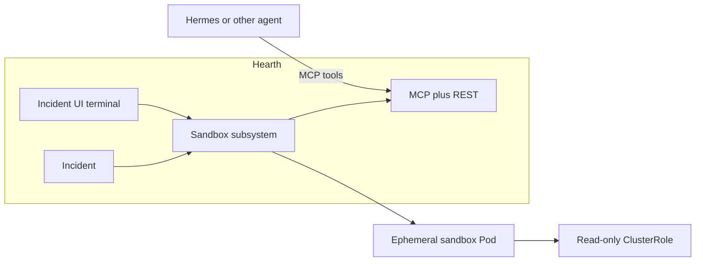

# Hearth triage sandbox

Hearth owns an **incident-scoped triage sandbox** that any LLM/agent platform can attach to. Hermes remains an optional investigate adapter; cluster tools (`kubectl`, `flux`, shell utils) run in Hearth sandboxes — not inside the Hermes pod.

## Architecture

| Piece | Role |
|-------|------|
| **Hearth** | Incident desk; sandbox lifecycle; MCP + REST + PTY |
| **`hearth-sandbox` image** | Tool container (`kubectl`, `flux`, `jq`, utils) + `sandbox-agent` on `:8080` |
| **Agent platforms** | Call MCP (`sandbox_exec`, `sandbox_status`, `sandbox_ensure`) with incident token |
| **Operators** | Open **Triage terminal** on the incident page (same sandbox) |

## APIs

| Surface | Purpose |
|---------|---------|
| `POST /api/incidents/:id/sandbox` | Ensure sandbox running |
| `GET /api/incidents/:id/sandbox` | Status / TTL / paths |
| `DELETE /api/incidents/:id/sandbox` | Tear down |
| `POST /api/incidents/:id/sandbox/exec` | Non-interactive command |
| `WS /api/incidents/:id/sandbox/terminal` | Interactive PTY (UI) |
| `POST /mcp` | MCP JSON-RPC (Streamable HTTP style) |

Auth: UI/API uses existing Hearth auth. MCP accepts `Authorization: Bearer <incident-token>` (from ensure, for ad-hoc clients) or global **`HEARTH_SANDBOX_AGENT_API_KEY`** (preferred for in-cluster agents).

**Never put API keys or bearer tokens in investigate chat prompts.** Agents must authenticate via MCP client config / environment only.

## Agent attach (LLM-agnostic)

1. Operator (or auto-triage) starts Investigate — or any agent calls `sandbox_ensure`.
2. Hearth creates/reuses the pod.
3. Investigate prompt includes MCP URL + incident id + instructions (**no secrets**).
4. Agent uses preconfigured MCP (`Authorization: Bearer $HEARTH_SANDBOX_AGENT_API_KEY`).

In-cluster MCP base: `http://hearth.observability.svc.cluster.local:8000/mcp` (`HEARTH_SANDBOX_CLUSTER_BASE_URL`).

## Config (env / Settings)

| Key | Env | Default |
|-----|-----|---------|
| Enable | `HEARTH_SANDBOX_ENABLED` | true |
| Backend | `HEARTH_SANDBOX_BACKEND` | `auto` (`kubernetes` in-cluster, else `local`) |
| Namespace | `HEARTH_SANDBOX_NAMESPACE` | `hearth-sandboxes` |
| Image | `HEARTH_SANDBOX_IMAGE` | `ghcr.io/nerddotdad/hearth-sandbox:0.1.0` |
| TTL | `HEARTH_SANDBOX_TTL_SECONDS` | `3600` |
| Cluster MCP base | `HEARTH_SANDBOX_CLUSTER_BASE_URL` | (set in GitOps) |

## Related

- [Hearth Agent](mk_hearth-agent.md) — Hermes core sidecar; consumes Hearth MCP
- Image source: [nerddotdad/hearth](https://github.com/nerddotdad/hearth) (`sandbox-image/`)
